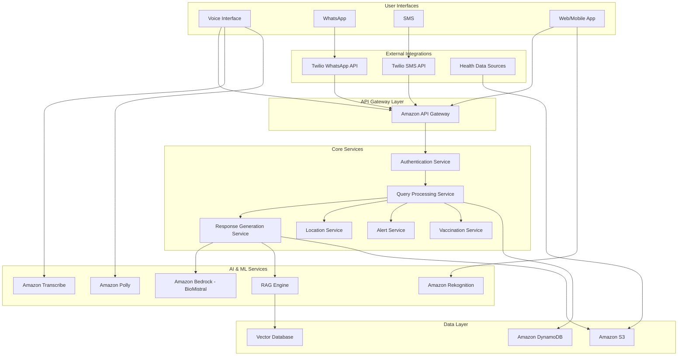

# Design Document: SwasthyaAI

## Overview

SwasthyaAI is a cloud-native, serverless multilingual AI public health platform built on AWS infrastructure. The system provides preventive healthcare guidance through multiple channels (voice, text, WhatsApp, SMS) in four Indian languages (English, Hindi, Kannada, Telugu). The architecture emphasizes safety, accessibility, and scalability while maintaining strict boundaries around medical advice vs. education.

The platform leverages Amazon Bedrock for AI capabilities, AWS Lambda for serverless compute, implements a comprehensive RAG system for verified health information, and provides seamless multi-channel access for users across rural and urban India.

## Architecture

### High-Level Architecture



### Component Architecture

The system follows a microservices architecture with the following key components:

1. **API Gateway Layer**: Single entry point for all requests with authentication and routing
2. **Core Services**: Business logic services for different functional areas
3. **AI & ML Services**: AWS AI services for natural language processing and generation
4. **Data Layer**: Persistent storage for user data, health information, and vector embeddings
5. **External Integrations**: Third-party services for messaging and data sources

## Components and Interfaces

### 1. API Gateway and Authentication

**Amazon API Gateway**
- Handles all incoming requests from multiple channels
- Implements rate limiting and request validation
- Routes requests to appropriate Lambda functions
- Manages CORS and security headers

**Authentication Service (AWS Lambda - Node.js)**
```javascript
class AuthenticationService {
    async authenticateUser(channel, userId) {
        // Validate user identity across channels
        // Create or retrieve user session from DynamoDB
        // Return authenticated session with permissions
    }
    
    async createAnonymousSession(channel) {
        // Create temporary session for anonymous users
        // Apply appropriate rate limits
        // Store session in DynamoDB with TTL
    }
}
```

### 2. Query Processing Service

**Query Processing Lambda (Node.js)**
```javascript
class QueryProcessor {
    async processQuery(query) {
        // Language detection and validation
        // Intent classification (health query, facility search, etc.)
        // Safety filtering for inappropriate content
        // Context extraction and enrichment
        return processedQuery;
    }
    
    detectLanguage(text) {
        // Detect user's language from input
        // Support English, Hindi, Kannada, Telugu
        // Use AWS Comprehend or custom language detection
    }
    
    classifyIntent(query, language) {
        // Determine query type (health question, emergency, facility search)
        // Route to appropriate service handler
        // Return intent classification
    }
}
```

### 3. AI and Response Generation

**Medical AI Engine (Amazon Bedrock Integration - Node.js)**
```javascript
const { BedrockRuntimeClient, InvokeModelCommand } = require('@aws-sdk/client-bedrock-runtime');

class MedicalAIEngine {
    constructor() {
        this.bedrockClient = new BedrockRuntimeClient({ region: 'us-east-1' });
        this.modelId = 'biomistral-7b';
    }
    
    async generateHealthResponse(query, context) {
        // Construct prompt with safety guidelines
        // Include RAG context and user query
        // Generate response using BioMistral-7B via Bedrock
        // Apply safety filters and disclaimers
        
        const command = new InvokeModelCommand({
            modelId: this.modelId,
            body: JSON.stringify({
                prompt: this.constructPrompt(query, context),
                max_tokens: 500,
                temperature: 0.1
            })
        });
        
        const response = await this.bedrockClient.send(command);
        return this.applySafetyFilters(response);
    }
    
    applySafetyFilters(response) {
        // Check for diagnostic language
        // Add appropriate disclaimers
        // Flag responses requiring human escalation
        return safeResponse;
    }
}
```

**RAG System (Node.js)**
```javascript
const { S3Client, GetObjectCommand } = require('@aws-sdk/client-s3');

class RAGEngine {
    constructor() {
        this.s3Client = new S3Client({ region: 'us-east-1' });
        this.vectorDb = new VectorDatabase(); // Using Pinecone or similar
    }
    
    async retrieveContext(query, language) {
        // Convert query to embeddings using AWS Bedrock
        // Search vector database for relevant health information
        // Retrieve and rank relevant documents from S3
        // Return contextualized information
        
        const embeddings = await this.generateEmbeddings(query);
        const relevantDocs = await this.vectorDb.search(embeddings);
        return this.formatContext(relevantDocs, language);
    }
    
    async updateKnowledgeBase(source) {
        // Process new health data from WHO/MoHFW
        // Generate embeddings for new content
        // Update vector database with new information
        // Store processed data in S3
    }
}
```

### 4. Voice Processing Services

**Voice Interface Handler (Node.js)**
```javascript
const { TranscribeClient, StartTranscriptionJobCommand } = require('@aws-sdk/client-transcribe');
const { PollyClient, SynthesizeSpeechCommand } = require('@aws-sdk/client-polly');

class VoiceProcessor {
    constructor() {
        this.transcribeClient = new TranscribeClient({ region: 'us-east-1' });
        this.pollyClient = new PollyClient({ region: 'us-east-1' });
    }
    
    async speechToText(audioData, language) {
        // Use Amazon Transcribe for speech recognition
        // Support multilingual input
        // Handle audio quality issues
        
        const params = {
            TranscriptionJobName: `job-${Date.now()}`,
            LanguageCode: this.mapLanguageCode(language),
            MediaFormat: 'wav',
            Media: {
                MediaFileUri: audioData
            }
        };
        
        const command = new StartTranscriptionJobCommand(params);
        const result = await this.transcribeClient.send(command);
        return this.processTranscriptionResult(result);
    }
    
    async textToSpeech(text, language) {
        // Use Amazon Polly for speech synthesis
        // Select appropriate voice for language
        // Optimize for mobile delivery
        
        const params = {
            Text: text,
            OutputFormat: 'mp3',
            VoiceId: this.selectVoiceForLanguage(language),
            LanguageCode: this.mapLanguageCode(language)
        };
        
        const command = new SynthesizeSpeechCommand(params);
        const result = await this.pollyClient.send(command);
        return result.AudioStream;
    }
}
```
### 5. Multi-Channel Integration

**Twilio WhatsApp Gateway (Node.js)**
```javascript
const twilio = require('twilio');

class TwilioWhatsAppGateway {
    constructor() {
        this.client = twilio(process.env.TWILIO_ACCOUNT_SID, process.env.TWILIO_AUTH_TOKEN);
        this.whatsappNumber = process.env.TWILIO_WHATSAPP_NUMBER;
    }
    
    async handleMessage(webhookData) {
        // Process incoming WhatsApp messages from Twilio
        // Handle text, voice, and image messages
        // Route to appropriate service handlers
        
        const { From, Body, MediaUrl0, MessageSid } = webhookData;
        
        const message = {
            from: From,
            body: Body,
            mediaUrl: MediaUrl0,
            messageId: MessageSid,
            channel: 'whatsapp'
        };
        
        return this.routeToQueryProcessor(message);
    }
    
    async sendResponse(userPhoneNumber, response) {
        // Format response for WhatsApp via Twilio
        // Handle message length limits
        // Send via Twilio WhatsApp API
        
        try {
            const message = await this.client.messages.create({
                from: `whatsapp:${this.whatsappNumber}`,
                to: `whatsapp:${userPhoneNumber}`,
                body: response.content
            });
            
            return { success: true, messageId: message.sid };
        } catch (error) {
            console.error('WhatsApp send error:', error);
            return { success: false, error: error.message };
        }
    }
}
```
**Twilio SMS Gateway (Node.js)**
```javascript
class TwilioSMSGateway {
    constructor() {
        this.client = twilio(process.env.TWILIO_ACCOUNT_SID, process.env.TWILIO_AUTH_TOKEN);
        this.smsNumber = process.env.TWILIO_SMS_NUMBER;
    }
    
    async handleSMS(smsData) {
        // Process incoming SMS messages from Twilio
        // Handle character encoding for Indian languages
        // Route to query processing service
        
        const { From, Body, MessageSid } = smsData;
        
        const message = {
            from: From,
            body: Body,
            messageId: MessageSid,
            channel: 'sms'
        };
        
        return this.routeToQueryProcessor(message);
    }
    
    async sendSMS(phoneNumber, message) {
        // Send SMS via Twilio
        // Handle message segmentation for long responses
        // Support Unicode for Indian languages
        
        try {
            // Split long messages if needed
            const messages = this.splitMessage(message, 1600);
            const results = [];
            
            for (const msgPart of messages) {
                const result = await this.client.messages.create({
                    from: this.smsNumber,
                    to: phoneNumber,
                    body: msgPart
                });
                results.push(result.sid);
            }
            
            return { success: true, messageIds: results };
        } catch (error) {
            console.error('SMS send error:', error);
            return { success: false, error: error.message };
        }
    }
}
```
### 6. Location and Alert Services

**Location Service (Node.js)**
```javascript
const { DynamoDBClient, QueryCommand } = require('@aws-sdk/client-dynamodb');

class LocationService {
    constructor() {
        this.dynamoClient = new DynamoDBClient({ region: 'us-east-1' });
    }
    
    async findNearbyFacilities(location, facilityType) {
        // Query DynamoDB for nearby healthcare facilities
        // Calculate distances and travel times
        // Return sorted list of facilities
        
        const params = {
            TableName: 'HealthFacilities',
            IndexName: 'LocationIndex',
            KeyConditionExpression: 'region_code = :region',
            FilterExpression: 'facility_type = :type',
            ExpressionAttributeValues: {
                ':region': { S: location.regionCode },
                ':type': { S: facilityType }
            }
        };
        
        const command = new QueryCommand(params);
        const result = await this.dynamoClient.send(command);
        
        return this.calculateDistancesAndSort(result.Items, location);
    }
    
    async getRegionalAlerts(location) {
        // Retrieve location-specific health alerts
        // Filter by relevance and urgency
        // Return active alerts for the region
        
        const params = {
            TableName: 'HealthAlerts',
            KeyConditionExpression: 'region_code = :region',
            FilterExpression: 'expiry_date > :now',
            ExpressionAttributeValues: {
                ':region': { S: location.regionCode },
                ':now': { S: new Date().toISOString() }
            }
        };
        
        const command = new QueryCommand(params);
        const result = await this.dynamoClient.send(command);
        
        return result.Items.map(item => this.parseAlert(item));
    }
}
```
**Alert System (Node.js)**
```javascript
const { SNSClient, PublishCommand } = require('@aws-sdk/client-sns');

class AlertSystem {
    constructor() {
        this.snsClient = new SNSClient({ region: 'us-east-1' });
        this.dynamoClient = new DynamoDBClient({ region: 'us-east-1' });
    }
    
    async createHealthAlert(alertData) {
        // Process incoming alert from health authorities
        // Determine affected geographic regions
        // Create targeted alert messages
        
        const alert = {
            alertId: `alert-${Date.now()}`,
            type: alertData.type,
            severity: alertData.severity,
            regions: alertData.affectedRegions,
            message: alertData.message,
            createdAt: new Date().toISOString(),
            expiryDate: alertData.expiryDate
        };
        
        // Store alert in DynamoDB
        await this.storeAlert(alert);
        
        // Distribute to affected users
        await this.distributeAlert(alert);
        
        return alert;
    }
    
    async distributeAlert(alert, targetUsers) {
        // Send alerts via preferred user channels
        // Track delivery and engagement
        // Handle failed deliveries
        
        const deliveryPromises = targetUsers.map(async (user) => {
            try {
                if (user.preferredChannel === 'whatsapp') {
                    return await this.sendWhatsAppAlert(user.whatsappId, alert);
                } else if (user.preferredChannel === 'sms') {
                    return await this.sendSMSAlert(user.phoneNumber, alert);
                }
            } catch (error) {
                console.error(`Failed to deliver alert to ${user.userId}:`, error);
                return { success: false, userId: user.userId, error: error.message };
            }
        });
        
        const results = await Promise.allSettled(deliveryPromises);
        return this.processDeliveryResults(results);
    }
}
```
## Data Models

### Core Data Structures

**User Model (TypeScript Interface)**
```typescript
interface User {
    userId: string;
    phoneNumber?: string;
    whatsappId?: string;
    preferredLanguage: Language;
    location?: Location;
    vaccinationProfile?: VaccinationProfile;
    createdAt: Date;
    lastActive: Date;
    privacySettings: PrivacySettings;
}

enum Language {
    ENGLISH = 'en',
    HINDI = 'hi',
    KANNADA = 'kn',
    TELUGU = 'te'
}

interface Location {
    latitude: number;
    longitude: number;
    regionCode: string;
    address?: string;
}

interface PrivacySettings {
    shareLocation: boolean;
    allowAlerts: boolean;
    dataRetentionDays: number;
}
```
**Health Query Model (TypeScript Interface)**
```typescript
interface HealthQuery {
    queryId: string;
    userId: string;
    channel: Channel;
    originalText: string;
    language: Language;
    intent: Intent;
    locationContext?: Location;
    timestamp: Date;
    safetyFlags: SafetyFlag[];
}

enum Channel {
    VOICE = 'voice',
    WHATSAPP = 'whatsapp',
    SMS = 'sms',
    WEB = 'web'
}

enum Intent {
    HEALTH_QUESTION = 'health_question',
    FACILITY_SEARCH = 'facility_search',
    VACCINATION_INFO = 'vaccination_info',
    EMERGENCY = 'emergency',
    GENERAL_INFO = 'general_info'
}

enum SafetyFlag {
    DIAGNOSTIC_REQUEST = 'diagnostic_request',
    EMERGENCY_SYMPTOMS = 'emergency_symptoms',
    INAPPROPRIATE_CONTENT = 'inappropriate_content'
}
```
**Health Response Model (TypeScript Interface)**
```typescript
interface HealthResponse {
    responseId: string;
    queryId: string;
    content: string;
    language: Language;
    sources: HealthSource[];
    disclaimers: string[];
    escalationRequired: boolean;
    confidenceScore: number;
    generatedAt: Date;
}

interface HealthSource {
    name: string;
    url: string;
    type: 'WHO' | 'MoHFW' | 'StateHealth' | 'Medical';
    lastUpdated: Date;
}
```
**Health Facility Model (TypeScript Interface)**
```typescript
interface HealthFacility {
    facilityId: string;
    name: string;
    facilityType: FacilityType;
    location: Location;
    contactInfo: ContactInfo;
    services: MedicalService[];
    operatingHours: OperatingHours;
    languagesSupported: Language[];
    lastUpdated: Date;
}

enum FacilityType {
    HOSPITAL = 'hospital',
    CLINIC = 'clinic',
    PHARMACY = 'pharmacy',
    PHC = 'phc',
    CHC = 'chc',
    VACCINATION_CENTER = 'vaccination_center'
}

interface ContactInfo {
    phoneNumber: string;
    email?: string;
    website?: string;
}

interface OperatingHours {
    monday: TimeSlot;
    tuesday: TimeSlot;
    wednesday: TimeSlot;
    thursday: TimeSlot;
    friday: TimeSlot;
    saturday: TimeSlot;
    sunday: TimeSlot;
    emergency24x7: boolean;
}

interface TimeSlot {
    open: string; // "09:00"
    close: string; // "17:00"
    closed: boolean;
}
```
**Vaccination Profile Model (TypeScript Interface)**
```typescript
interface VaccinationProfile {
    profileId: string;
    userId: string;
    vaccinations: VaccinationRecord[];
    upcomingVaccines: VaccineReminder[];
    familyMembers: FamilyMember[];
    createdAt: Date;
    updatedAt: Date;
}

interface VaccinationRecord {
    vaccineId: string;
    vaccineName: string;
    dateAdministered: Date;
    facilityId: string;
    batchNumber?: string;
    nextDueDate?: Date;
}

interface VaccineReminder {
    vaccineId: string;
    vaccineName: string;
    dueDate: Date;
    reminderSent: boolean;
    priority: 'high' | 'medium' | 'low';
}

interface FamilyMember {
    memberId: string;
    name: string;
    relationship: string;
    dateOfBirth: Date;
    vaccinationProfile: VaccinationProfile;
}
```
### Database Schema (DynamoDB)

**Users Table**
- Partition Key: user_id
- Sort Key: None
- GSI: phone_number, whatsapp_id
- Attributes: All user profile data

**Queries Table**
- Partition Key: user_id
- Sort Key: timestamp
- GSI: query_id
- Attributes: Query data and metadata

**Facilities Table**
- Partition Key: region_code
- Sort Key: facility_id
- GSI: facility_type, location_coordinates
- Attributes: Facility information and services

**Alerts Table**
- Partition Key: region_code
- Sort Key: alert_timestamp
- GSI: alert_type, expiry_date
- Attributes: Alert content and targeting data

### S3 Data Organization

**Health Knowledge Base**
```
s3://swasthyaai-knowledge/
├── who-guidelines/
│   ├── english/
│   ├── hindi/
│   ├── kannada/
│   └── telugu/
├── mohfw-data/
│   ├── national/
│   └── state-wise/
├── embeddings/
│   └── vector-index/
└── media/
    ├── images/
    └── audio/
```

**User Data**
```
s3://swasthyaai-userdata/
├── voice-recordings/
│   └── {user_id}/
├── image-uploads/
│   └── {user_id}/
└── conversation-logs/
    └── {date}/
```
## Correctness Properties

*A property is a characteristic or behavior that should hold true across all valid executions of a system—essentially, a formal statement about what the system should do. Properties serve as the bridge between human-readable specifications and machine-verifiable correctness guarantees.*

### Property 1: Comprehensive Medical Safety Enforcement
*For any* health-related query and response, the system should never provide diagnostic statements, should always include medical disclaimers, should redirect diagnostic requests to professional medical consultation, and should immediately recommend emergency care for emergency symptoms.
**Validates: Requirements 1.3, 1.4, 7.2, 9.1, 9.2, 9.3**

### Property 2: Verified Source Grounding and Prioritization
*For any* health information response, all content should be traceable to verified sources from WHO, Ministry of Health & Family Welfare, or state health departments, with official government and WHO guidelines prioritized over other sources, and authoritative sources cited when possible.
**Validates: Requirements 1.2, 1.5, 5.4, 10.1, 10.3, 10.4**

### Property 3: Voice Processing Language Consistency
*For any* voice input in supported languages (English, Hindi, Kannada, Telugu), the system should correctly transcribe speech to text and convert responses back to speech in the same language, preserving meaning and language consistency.
**Validates: Requirements 2.1, 2.2, 2.4**

### Property 4: Voice Input Clarity and Fallback Handling
*For any* unclear, incomplete, or failed voice input, the system should request clarification rather than making assumptions, and gracefully fallback to text-based interaction when voice processing fails.
**Validates: Requirements 2.3, 2.5**

### Property 5: Multi-Channel Routing Consistency
*For any* health query sent through WhatsApp, SMS, or voice channels, the message should be properly routed to the Medical AI Engine and the response should be delivered through the same channel with appropriate formatting for that medium.
**Validates: Requirements 3.1, 3.2, 3.3**

### Property 6: WhatsApp Multi-Media Support
*For any* WhatsApp interaction, the system should support text, voice messages, and image sharing with proper processing for each media type.
**Validates: Requirements 3.4**

### Property 7: SMS Character Limit Handling
*For any* SMS interaction, the system should handle text-only messages with appropriate character limit considerations and message segmentation.
**Validates: Requirements 3.5**

### Property 8: Location-Based Service Completeness
*For any* user location and facility search request, returned healthcare facilities should be within reasonable distance and include complete information (contact details, services available, distance from user location).
**Validates: Requirements 4.1, 4.2**

### Property 9: Geographic Alert Targeting
*For any* health alert issued for a geographic region, only users in that specific area should receive the notification through their preferred channels.
**Validates: Requirements 4.3, 5.3**

### Property 10: Location Privacy Compliance
*For any* location-based service request, the system should only use location data when explicitly provided by the user and request manual input when location services are unavailable.
**Validates: Requirements 4.4, 4.5**
### Property 11: Alert Generation and Lifecycle Management
*For any* disease outbreak or weather-related health risk data, the system should generate appropriate location-specific alerts from verified sources and send follow-up notifications when alerts are no longer relevant.
**Validates: Requirements 5.1, 5.2, 5.5**

### Property 12: Vaccination Schedule Compliance and Adjustment
*For any* vaccination history provided by a user, the generated immunization schedule should follow official guidelines, send reminders at appropriate times, display complete information (vaccine names, due dates, nearby centers), and adjust future reminders when records are updated.
**Validates: Requirements 6.1, 6.2, 6.3, 6.4, 6.5**

### Property 13: Image Analysis Educational Safety
*For any* user-submitted symptom image, the system should provide educational information about similar conditions while emphasizing that visual assessment cannot replace professional diagnosis, recommend medical consultation for concerning symptoms, and request clearer images when quality is insufficient.
**Validates: Requirements 7.1, 7.2, 7.3, 7.4, 7.5**

### Property 14: Automated Workflow Orchestration
*For any* scheduled data update or complex user interaction, AWS Lambda functions should coordinate workflows, implement fallback procedures when data sources are unavailable, and alert administrators while attempting recovery when workflows fail.
**Validates: Requirements 8.1, 8.2, 8.3, 8.5**

### Property 15: Secure Data Storage and Compliance
*For any* user data storage operation, the system should encrypt all communications and health data in DynamoDB and S3, apply appropriate security measures, and maintain interaction logs for compliance.
**Validates: Requirements 8.4, 9.4**

### Property 16: Medical Consultation Escalation Pathways
*For any* situation where users need human medical consultation, the system should provide clear escalation pathways and guidance.
**Validates: Requirements 9.5**

### Property 17: Data Freshness and Conflict Resolution
*For any* health information update, the system should integrate changes within 24 hours and present the most recent official guidance when conflicting information exists.
**Validates: Requirements 10.2, 10.5**

### Property 18: Comprehensive Data Privacy Protection
*For any* user communication or health data, the information should be encrypted in storage, personal identifiers should be anonymized in interaction logs, and the system should not share data with third parties without explicit consent.
**Validates: Requirements 11.1, 11.2, 11.4**

### Property 19: Data Deletion and Breach Response Compliance
*For any* user data deletion request, the system should remove information from all AWS services within 30 days, and for any data breach, affected users should be notified within 72 hours.
**Validates: Requirements 11.3, 11.5**

### Property 20: System Performance and Resilience
*For any* user query under normal conditions, the system should respond within 10 seconds, optimize responses for low bandwidth when network connectivity is poor, gracefully degrade functionality while maintaining core services during component failures, and queue requests with estimated wait times during high load.
**Validates: Requirements 12.1, 12.2, 12.3, 12.5**
## Error Handling

### Error Classification

**System Errors**
- AWS service failures (Bedrock, Transcribe, Polly, DynamoDB, S3)
- Database connectivity issues
- External API failures (WhatsApp Business API, SMS providers)
- Network timeouts and connectivity issues
- Vector database search failures
- Data source unavailability (WHO, MoHFW, state health departments)
- Workflow orchestration failures in Lambda functions

**User Input Errors**
- Invalid or unclear voice input
- Unsupported languages or dialects
- Inappropriate or harmful content
- Malformed requests from external channels
- Poor quality images for symptom analysis
- Invalid location data or coordinates
- Incomplete vaccination history information

**Medical Safety Errors**
- Queries requesting medical diagnosis
- Emergency medical situations requiring immediate care
- Potentially harmful medical advice requests
- Unverified health information requests
- Concerning symptoms requiring professional consultation

**Privacy and Security Errors**
- Data encryption failures
- Unauthorized access attempts
- Data breach incidents
- Privacy policy violations
- Consent management failures

### Error Handling Strategies

**Graceful Degradation (Node.js)**
```javascript
class ErrorHandler {
    constructor() {
        this.fallbackResponses = new Map();
        this.logger = require('./logger');
    }
    
    async handleAIServiceFailure(query) {
        // Provide pre-written health guidance from cache
        // Direct user to verified health resources
        // Escalate to human support if needed
        
        this.logger.error('AI service failure', { queryId: query.queryId });
        
        const fallbackResponse = this.fallbackResponses.get(query.intent) || {
            content: "I'm experiencing technical difficulties. Please consult your healthcare provider or call emergency services if urgent.",
            disclaimers: ["This is an automated fallback response"],
            escalationRequired: true
        };
        
        return fallbackResponse;
    }
}
```
## Testing Strategy

### Dual Testing Approach

The testing strategy combines unit tests for specific functionality with property-based tests for universal correctness properties. This ensures both concrete bug detection and comprehensive input coverage.

**Unit Testing Focus:**
- Specific examples of correct health guidance responses
- Integration points between AWS services (Bedrock, Transcribe, Polly)
- Edge cases in voice processing and language detection
- Error conditions and safety violations
- Multi-channel message formatting and delivery
- Vaccination schedule calculations for specific scenarios
- Location-based facility search with known coordinates
- Emergency symptom detection and escalation examples
- Data encryption and anonymization for specific data types
- Specific breach notification scenarios

**Property-Based Testing Focus:**
- Universal properties that hold across all user inputs
- Medical safety enforcement across diverse health queries
- Source verification and grounding for all responses
- Language consistency across different channels and voice processing
- Multi-channel routing consistency for all message types
- Location-based service accuracy across various geographic inputs
- Alert targeting precision across different regions and user preferences
- Vaccination schedule compliance across various user histories
- Image analysis safety across different symptom images
- Data privacy protection across all user interactions
- System performance and resilience under varying conditions
- Workflow orchestration across complex user scenarios

**Property-Based Testing Configuration:**
- Use fast-check (JavaScript/TypeScript) for property-based testing
- Minimum 100 iterations per property test due to randomization
- Each property test references its corresponding design document property
- Tag format: **Feature: swasthya-ai, Property {number}: {property_text}**
- Each correctness property implemented by a single property-based test
- AWS service mocking using AWS SDK mocks for isolated testing
- Integration tests with actual AWS services in staging environment
- Load testing using AWS Load Testing solution for performance validation

**Test Environment Setup:**
- Use AWS LocalStack for local development testing
- Separate AWS accounts for development, staging, and production
- Automated testing pipeline using AWS CodePipeline and CodeBuild
- Performance testing using AWS Load Testing solution
- Security testing for data encryption and privacy compliance
- Multi-language testing with native speakers for accuracy validation
- Property test generators for health queries, voice samples, geographic data, vaccination histories, symptom images, user data, and system conditions